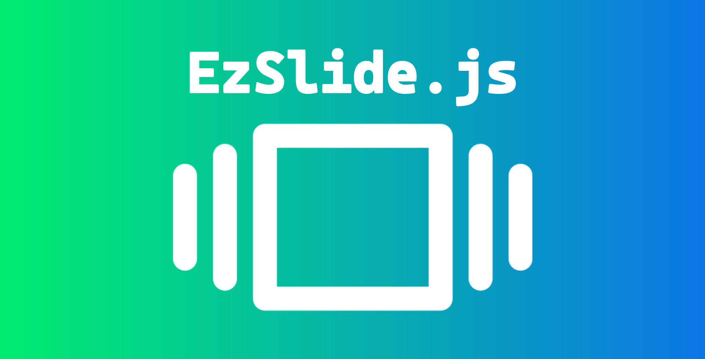

# ez-slide.js



A simple and easy to use slide show library for web pages.
Inspired by [FullPage.js](https://alvarotrigo.com/fullPage/) but simpler, lighter and free to use.

## How to use
Simply include the `ez-slide.js` and `ez-slide.css` files in your project and configure the library like this:

```javascript
EzSlide({
    containerSelector : '.slides-container',
    slideSelector : '.slide',
    transitionDurationSeconds : 0.5,
    transitionOffsetSeconds : 0.3,
    scrollSensitivity : 8,
    enableAnchorNavigation: true,
    anchorPrefix : 'slide-',
    enableKeyboardNavigation: true,
    enableNavigationDots: true,
    navigationDotsPosition: 'right',
    onSlideChange: function(index) {
        console.log('Slide changed to ' + index);
    }
});
```

This assumes you have an HTML structure like this:

```html
<div class="slides-container">
    <div class="slide">Slide 1</div>
    <div class="slide">Slide 2</div>
    <div class="slide">Slide 3</div>
</div>
```

## How to contribute
Feel free to contribute to this project by forking it and submitting a pull request or by opening an issue.
I'll be happy to review and merge your contributions :)

## License
This project is licensed under the MIT License

Permission is hereby granted, free of charge, to any person obtaining a copy
of this software and associated documentation files (the "Software"), to deal
in the Software without restriction, including without limitation the rights
to use, copy, modify, merge, publish, distribute, sublicense, and/or sell
copies of the Software, and to permit persons to whom the Software is
furnished to do so, subject to the following conditions:

The above copyright notice and this permission notice shall be included in all
copies or substantial portions of the Software.

THE SOFTWARE IS PROVIDED "AS IS", WITHOUT WARRANTY OF ANY KIND, EXPRESS OR
IMPLIED, INCLUDING BUT NOT LIMITED TO THE WARRANTIES OF MERCHANTABILITY,
FITNESS FOR A PARTICULAR PURPOSE AND NONINFRINGEMENT. IN NO EVENT SHALL THE
AUTHORS OR COPYRIGHT HOLDERS BE LIABLE FOR ANY CLAIM, DAMAGES OR OTHER
LIABILITY, WHETHER IN AN ACTION OF CONTRACT, TORT OR OTHERWISE, ARISING FROM,
OUT OF OR IN CONNECTION WITH THE SOFTWARE OR THE USE OR OTHER DEALINGS IN THE
SOFTWARE.
